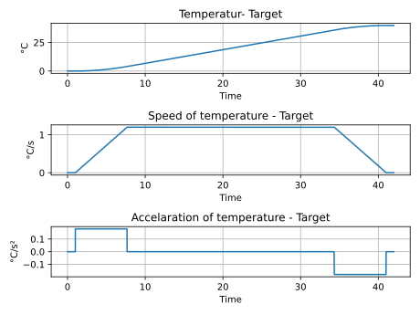

:toc:

== Architecture
This is the first design concept.
:stem: latexmath

image::../../../media/Design_Concept.svg[Embedded,1000,opts=inline]

== Dual-MCP23S17-PCB
=== PCB-Layout

A simple layout for to MCP23S17 chips on a strip grid board. +
Using a hardwired address for the SPI-bus. +
Adding a reset button for both chips. +

image::../../../media/MCP23S17_Dual_Platine_V2_Steckplatine.svg[Embedded,1000,opts=inline]

=== Schematic

image::../../../media/MCP23S17_Dual_Platine_V2_Schaltplan.svg[Embedded,1000,opts=inline]

== Target Temperature
This will be an example for a trajectory for the target temperature

== Step sequence "brewery"
First concept of a step sequence for the brewery. +
Is made for discussion. +

image::../../../media/brewery sfc.svg[]
NOTE: made with: https://lucid.co/product/lucidchart

== model of hardware simulation

The model of the pot is based on a thermal capacitor with to inputs (burner and ambient air) conducted via two thermal resistors.

.differential equation
[latexmath]
++++
\dot{Q}= \frac{T_{burner}-T_{brew}}{R_{bb}} + \frac{T_{air}-T_{brew}}{R_{ab}}
++++

.make the integral of the equation.
[latexmath]
++++
{Q}= \int \frac{T_{burner}-T_{brew}}{R_{bb}} + \frac{T_{air}-T_{brew}}{R_{ab}}
++++

.measuring equation
[latexmath]
++++
{Q}\cdot\frac{1}{C_{brew}\cdot R_{ab}}= T_{brew}
++++

.time constant and gain of PT1 system
[latexmath]
++++
T_{1} = \tau = C_{brew}\cdot R_{ab} \\
K_P = 1
++++

TODO: - make a block diagram - describe PT1 output (multiplying with thermal resistor and why)

