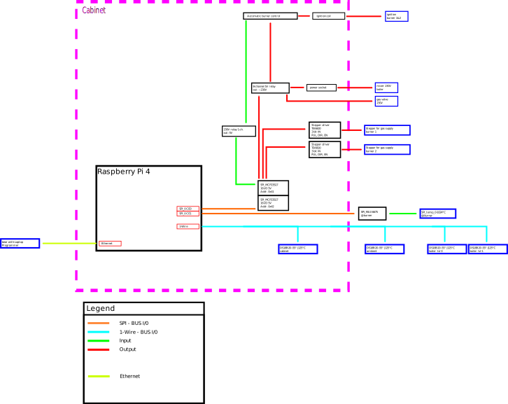
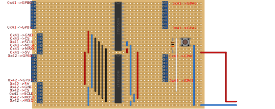
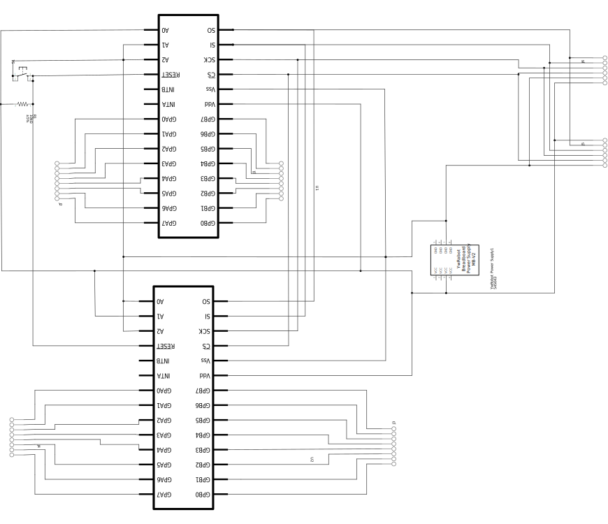
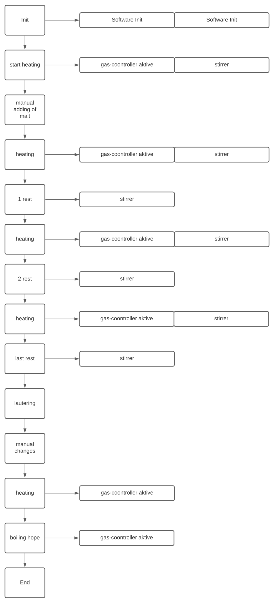

:toc:

== Architecture
This is the first design concept.

== Dual-MCP23S17-PCB
=== PCB-Layout

A simple layout for to MCP23S17 chips on a strip grid board. +
Using a hardwired address for the SPI-bus. +
Adding a reset button for both chips. +

=== Schematic

== Step sequence "brewery"
First concept of a step sequence for the brewery. +
Is made for discussion. +

NOTE: made with: https://lucid.co/product/lucidchart

